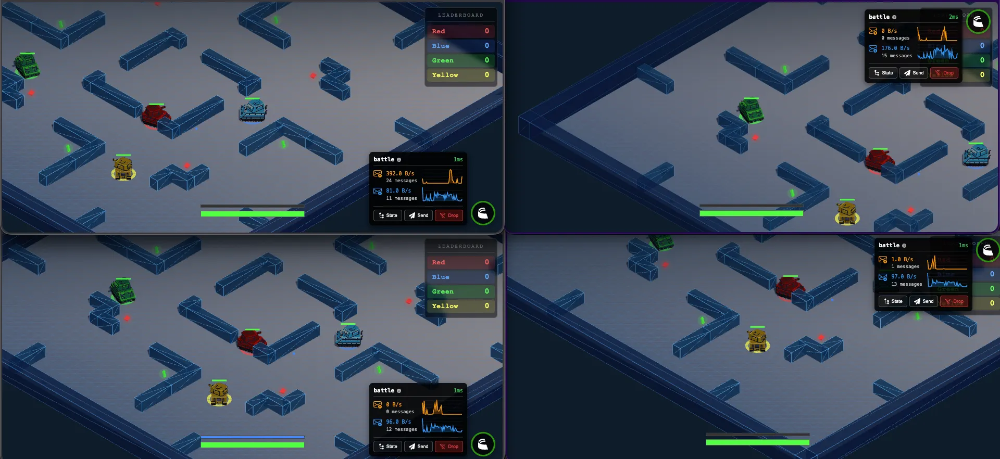

# Tank Battle Multiplayer

A multiplayer tank battle game built with [Colyseus](https://colyseus.io/) and [Three.js](https://threejs.org/).

Based on the original [Tanx](http://playcanv.as/p/aP0oxhUr) PlayCanvas demo by [Max M](https://github.com/Maksims). The original version is available at [cvan/tanx-1](https://github.com/cvan/tanx-1).



## Project Structure

- `server/` — Game server powered by Colyseus 0.17
- `client/` — Game client built with Three.js and Vite

## Getting Started

Install dependencies for both server and client:

```bash
cd server && npm install
cd ../client && npm install
```

Start the server:

```bash
cd server && npm run dev
```

Start the client (in a separate terminal):

```bash
cd client && npm run dev
```

## License

MIT — See [LICENSE](LICENSE) file.
