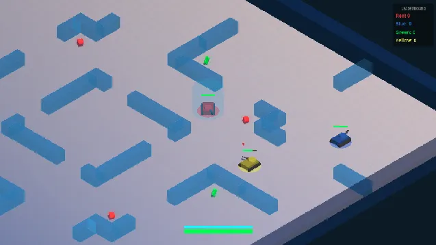

# Tank Battle Multiplayer - Godot Client



Godot 4.3+ client for the Tank Battle Multiplayer game, using the [Colyseus Godot Extension](https://docs.colyseus.io/getting-started/godot).

## Setup

### 1. Install the Colyseus Godot Extension

1. Download the latest SDK from [GitHub Releases](https://github.com/colyseus/native-sdk/releases)
2. Extract the `addons/` folder into this `godot/` project root
3. Open the project in Godot 4.3+
4. Enable the plugin: **Project → Project Settings → Plugins → Colyseus → Enable**

### 2. Start the Server

```bash
cd ../server
npm install
npm start
```

The server runs on `ws://localhost:2567` by default.

### 3. Run the Game

Open `godot/` in the Godot editor and press **F5** (or the Play button).

To connect to a different server, pass the `--server` argument:

```
--server=wss://your-server.example.com
```

## Controls

| Input | Action |
|-------|--------|
| W / Arrow Up | Move forward |
| S / Arrow Down | Move backward |
| A / Arrow Left | Move left |
| D / Arrow Right | Move right |
| Mouse | Aim turret |
| Left Click | Shoot |

## Project Structure

```
godot/
├── project.godot          # Godot project configuration
├── scenes/
│   └── main.tscn          # Main scene
└── scripts/
    ├── game.gd            # Game manager, networking, input, HUD
    ├── tank_entity.gd     # Tank visual entity with animations
    └── map_renderer.gd    # Map builder (ground, blocks, walls)
```

## Web Export

When exporting to web, enable **Extensions Support** in **Project → Export → Web (Runnable)**.
