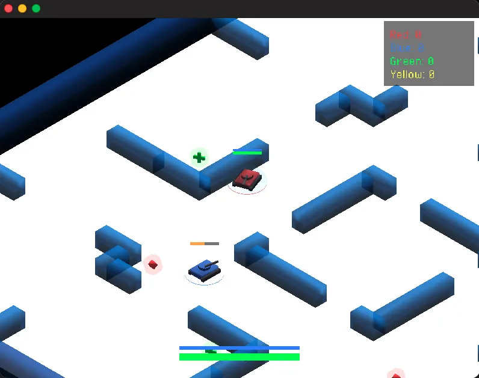

# Tank Battle Multiplayer — Haxe + Heaps

A game client for [Tank Battle Multiplayer](../README.md) built with [Haxe](https://haxe.org/) and the [Heaps](https://heaps.io/) game engine.



## Prerequisites

- [Haxe 4.3+](https://haxe.org/download/)
- Install dependencies:

```bash
haxelib install heaps
haxelib install colyseus
haxelib install hlsdl      # native only
haxelib install hashlink   # native only
```

## Build & Run — Web (JS)

```bash
haxe build.js.hxml
npx serve .
# Open http://localhost:3000/index.html
```

## Build & Run — Native (HashLink/C)

```bash
# Requires: brew install hashlink
./build-native.sh
DYLD_LIBRARY_PATH=/opt/homebrew/Cellar/hashlink/*/lib ./game_native
```

Make sure the [game server](../server/) is running on port 2567.

## Controls

- **WASD / Arrow keys** — Move
- **Mouse** — Aim turret
- **Left click** — Shoot
